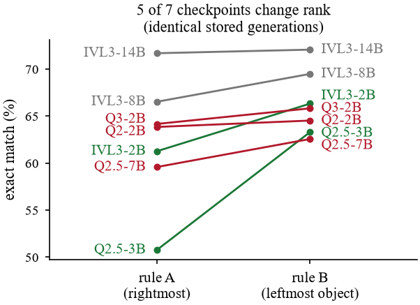
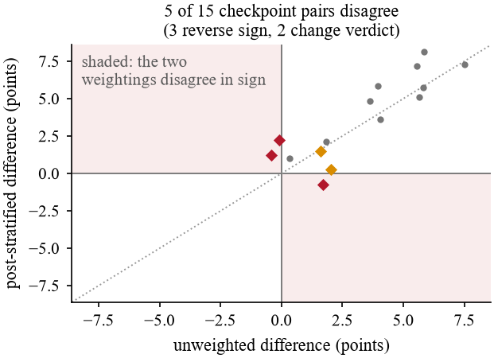

# Rethinking GQA Evaluation — code and data

Code, stored model outputs and results for:

> A. Chaudhary, D. Sharma. **"Rethinking GQA Evaluation: How Answer Normalisation and Type Weighting Alter Small Vision-Language Model Rankings."** INSPECT 2026, IIT Patna. Accepted; proceedings in IEEE Xplore.

Every number in the paper regenerates from the stored per-question generations in `data/`. **No GPU and no inference are needed**: the scripts replay saved text.

## The two findings

**1. Answer normalisation alone reorders the leaderboard.** GQA is scored by exact match, so a multi-token answer has to be reduced to one token before scoring. Two reasonable rules do this differently: rule A takes the *rightmost* vocabulary match, rule B the *leftmost non-attribute* token. Applied to the **same stored generations** (natural draw, n = 5,000):

| Checkpoint | Rule A EM | Rule B EM | Shift | Rank A → B |
|---|---|---|---|---|
| InternVL3-14B | 71.68 | 72.06 | +0.38 | 1 → 1 |
| InternVL3-8B | 66.52 | 69.48 | +2.96 | 2 → 2 |
| Qwen3-VL-2B | 64.16 | 65.82 | +1.66 | 3 → 4 |
| Qwen2-VL-2B | 63.84 | 64.52 | +0.68 | 4 → 5 |
| InternVL3-2B | 61.26 | 66.32 | +5.06 | 5 → 3 |
| Qwen2.5-VL-7B | 59.58 | 62.56 | +2.98 | 6 → 7 |
| Qwen2.5-VL-3B | 50.76 | 63.30 | **+12.54** | 7 → 6 |

Shifts range from **0.38 to 12.54 points**, and **5 of 7** checkpoints change rank. Neither rule dominates: rule B recovers 1,398 questions and loses 85. Per-checkpoint disagreement between the rules runs from 2.3 % to 27.0 %. The size of a checkpoint's correction tracks how often its raw answer already lands in the GQA vocabulary (Spearman ρ = −1.000, Pearson r = −0.970, n = 7). The correction measures phrasing, not capability.



**2. Post-stratification changes the verdict.** On a type-balanced sample, McNemar's test compares the *macro* average, not accuracy under the real GQA type mix. Re-weighting to the deployment distribution (choose 12.7 %, compare 3.1 %, logical 12.0 %, query 51.2 %, verify 20.9 %) and testing that difference directly, **5 of 15** checkpoint pairs disagree between the two analyses: **3 reverse sign** and **2 change significance**.

| Pair (balanced draw) | Unweighted Δ (z) | Post-stratified Δ (z) | |
|---|---|---|---|
| Qwen2.5-VL-3B vs Qwen3-VL-2B | +1.70 (2.62) | −0.74 (−0.87) | sign flip |
| InternVL3-2B vs Qwen2.5-VL-3B | −0.10 (−0.15) | +2.24 (2.56) | sign flip |
| InternVL3-2B vs Qwen2-VL-2B | −0.42 (−0.67) | +1.24 (1.40) | sign flip |
| Qwen2-VL-2B vs Qwen3-VL-2B | +2.02 (3.29) | +0.26 (0.32) | verdict change |
| InternVL3-2B vs Qwen3-VL-2B | +1.60 (2.52) | +1.50 (1.78) | verdict change |



## Reproduce

Run from the repository root:

```bash
python src/analysis.py       # rank changes, 15-pair comparison  -> results/results.json
python src/normdiff.py       # rule A vs rule B gained / lost       -> results/normdiff.json
python src/verbosity.py      # in-vocabulary rate vs correction     -> results/verbosity.json
python src/normexamples.py   # example answers where the rules differ
python src/make_figures.py   # figures/
```

Python 3 standard library only, plus matplotlib for the figures. The bootstrap is exact and multinomial (`src/stdlib_boot.py`), so numpy is not needed.

**Reproduction check (2026-10-04):** `results.json`, `normdiff.json` and `verbosity.json` match the paper's canonical results exactly, except the stratified bootstrap 95 % intervals, which differ by at most 0.04 points (Monte Carlo variation). Every point estimate, z-score and disagreement flag is identical.

## Contents

| Path | What it is |
|---|---|
| `src/gqa_answer_norm.py` | The normaliser: prefix stripping, lexical normalisation, vocabulary snap. The rule A / rule B difference is the token-selection step. |
| `src/analysis.py` | Balanced-draw table, McNemar, post-stratified paired test, 15-pair comparison, normaliser rank analysis. |
| `src/normdiff.py`, `src/verbosity.py`, `src/normexamples.py`, `src/make_figures.py` | Rule A vs rule B gain/loss, the in-vocabulary correlation, worked examples, and the figures. |
| `data/natural/<model>/` | Natural type mix, 5,000 questions (seed 42), 7 public checkpoints, single pass. `pq_*.jsonl` holds per question: qid, type, question, ground truth, raw generation, scored answer. |
| `data/balanced/<model>/` | 1,000 questions per structural type, 6 checkpoints. The two draws are independent apart from 182 shared questions. |
| `results/`, `figures/` | Outputs of the scripts above. |

Questions and answers come from [GQA](https://cs.stanford.edu/people/dorarad/gqa/) (Hudson & Manning, 2019). Checkpoints are the public InternVL3 (2B / 8B / 14B) and Qwen2-VL-2B, Qwen2.5-VL-3B / 7B and Qwen3-VL-2B Instruct releases.

## Citation

```bibtex
@inproceedings{chaudhary2026rethinking,
  title     = {Rethinking {GQA} Evaluation: How Answer Normalisation and Type Weighting Alter Small Vision-Language Model Rankings},
  author    = {Chaudhary, Ayush and Sharma, Dhruv},
  booktitle = {INSPECT 2026},
  year      = {2026},
  note      = {Accepted, to appear in IEEE Xplore}
}
```
